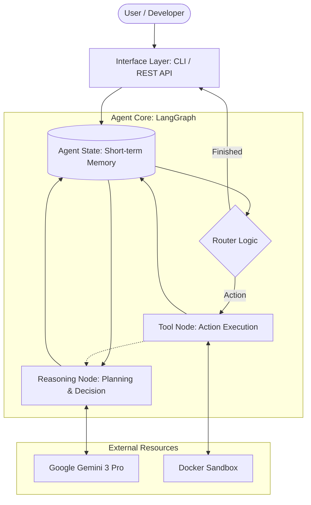

# Project: Agent Zero - Master Architecture & Implementation Guide

## 1. Introduction & Design Philosophy

### 1.1 What is "Agent Zero"?
**Agent Zero** is a prototype for a production-grade **Autonomous AI Agent**. Unlike a chatbot (which generates text), an agent generates **actions**. It perceives a goal, breaks it down into steps, executes tools (performing tasks, editing files), observes the results, and iterates until the goal is met.

### 1.2 The "Why" Behind the Architecture
When designing a system like this, we must solve three specific problems that standard software doesn't face:
1.  **Non-Deterministic Control Flow:** Standard code follows `A -> B -> C`. Agents follow `A -> (Think) -> B or C or A (Retry)`. We need a **State Machine**, not a linear script.
2.  **Safety & Containment:** If an agent can "modify files," it can accidentally delete your hard drive. We need a **Sandbox** (Docker).
3.  **State Persistence:** Agents take time. We need a way to save the "brain state" (memory) so we can pause/resume execution.

---

## 2. High-Level Design (HLD)

The HLD provides the "30,000-foot view" of the system. In system design, we use **Block Diagrams** to show how data flows between major subsystems.

### 2.1 Architectural Diagram (Cyclic State Machine)

This is a **Cyclic Graph**. Notice how the arrows loop back. This "Loop" is the core of agentic behavior. 

`reason > state > router logic` is a fundamental design choice in state-based agents. In these systems, nodes (like "Reason") don't typically "talk" to each other directly; instead, they both talk to the **State**. 




**Flow Explanation:**

1.  **Initialization:** The `User` submits a request via the `API` (CLI). This initializes the `Agent State` with the user's message.
2.  **Reasoning (The Thinking Process):** The `Reason` node (the brain) receives the current `State`. It prepends a **System Prompt** (instructions on *how* to think) to the conversation history and queries `Google Gemini 3 Pro` (LLM). The LLM analyzes the history, the available tools, and the goal to generate a "Thought" or a "Tool Call".
3.  **Decision:** The `Router` evaluates the LLM's response.
    *   If the LLM requests a tool call (e.g., "write_file"), the flow moves to `Execute`.
    *   If the LLM provides a final answer, the flow returns to the `API` and the user.
4.  **Execution:** The `Execute` node runs the requested tool inside the secure `Docker Sandbox`.
5.  **Observation:** The result of the tool execution (success or error) is written back to the `State` (Memory).
6.  **Loop:** The flow cycles back to the `Reason` node. The LLM sees the new state (including the tool output) and decides what to do next (e.g., "Did that work? If yes, move to next step. If no, try a different approach.").

### 2.2 Component Breakdown

This table details every major component, its responsibility, and the technology choice.

| Component | Technology | Responsibility | Design Rationale (Why?) |
| :--- | :--- | :--- | :--- |
| **Orchestrator** | **LangGraph** | Manages the "State Machine". Decides which node runs next. Handles loops and persistence. | Standard chains (LangChain) are linear (DAGs). Agents need loops. LangGraph is built specifically for cyclic graphs. |
| **Intelligence** | **Google Gemini** | The "Brain". Parses user intent, plans steps, and formats tool calls. | Gemini 3 Pro Preview has a massive context window (1M+ tokens), allowing it to read entire codebases in one shot. |
| **Runtime** | **Docker** | The "Body". Executes the actual file changes and shell commands. | **Security.** A mounted volume (`./workspace`) ensures the agent can *only* touch files we explicitly allow, protecting the host OS. |
| **Interface** | **Python/Typer** | CLI entry point. Handles arguments and output formatting. | Simple, typed, and robust for command-line tools. |
| **Validation** | **Pydantic** | Validates data entering and leaving the agent. | LLMs output text. Code needs types. Pydantic bridges this gap, preventing "hallucinated" arguments from crashing the app. |
| **Package Mgr** | **Poetry 2.0** | Manages Python dependencies and virtual environments. | Ensures **Reproducibility**. `pip freeze` is often insufficient. Poetry locks exact versions to avoid "it works on my machine" bugs. |

### 2.3 Key Technology Explanations

Here is a deeper look at the specific tools chosen and their roles in the architecture.

#### Interface: Python & Typer
*   **The Technology:** [Typer](https://typer.tiangolo.com/) is a modern library for building CLI applications based on standard Python type hints.
*   **Responsibility:** It serves as the **Entry Point** (Front-End). It parses command-line arguments, validates user input before the agent starts, and handles output formatting (colors, spinners) to improve the user experience.
*   **Rationale:** It is **Simple, Typed, and Robust**. By using Python types, it catches errors early (e.g., passing a string when an integer is needed) and auto-generates `--help` documentation.

#### Orchestrator: LangGraph
*   **The Technology:** A library specifically designed for building stateful, multi-actor applications with LLMs.
*   **Responsibility:** It manages the **Control Flow**. Unlike a standard script, it handles the "loops" where the agent tries, fails, and retries. It also manages **State Persistence**, allowing the agent to remember what happened 5 steps ago.
*   **Rationale:** Standard chains are linear (Start -> End). Agents are cyclic (Start -> Think -> Act -> Think ...). LangGraph makes building these loops intuitive and reliable.

#### Runtime: Docker
*   **The Technology:** The industry standard for containerization.
*   **Responsibility:** It provides a **Secure Sandbox**. The agent executes its code changes inside a container, isolated from your actual computer.
*   **Rationale:** **Safety.** If the agent accidentally runs `rm -rf /`, it only deletes the temporary container, not your operating system.

#### Validation: Pydantic
*   **The Technology:** The most widely used data validation library for Python.
*   **Responsibility:** It acts as the **Bridge** between the fuzzy text of an LLM and the strict code of the application. It forces the LLM's output to conform to specific schemas.
*   **Rationale:** **Reliability.** It prevents "hallucinated" arguments from crashing the application by validating data types at runtime.

---

## 3. Low-Level Design (LLD) & Project Structure

This section explains *how* we structure the code and *why*.

### 3.1 Project Structure Strategy
We follow a **Layered Architecture**. Each layer has a distinct responsibility, preventing "Spaghetti Code".

```text
agent-zero/
├── pyproject.toml       # The "Project Manifest". Defines dependencies and metadata.
├── Dockerfile           # The "Blueprint" for the safe runtime environment.
├── .env                 # Secrets (API Keys). Never committed to Git.
└── src/                 # The Source Code.
    ├── main.py          # Entry Point. The "Key" that starts the engine.
    ├── config.py        # Configuration Layer. Validates environment variables.
    ├── core/            # Core Domain. Things shared by the whole app (LLM, State).
    ├── agent/           # Application Logic. The LangGraph definitions (Brain).
    └── tools/           # Infrastructure Layer. The actual functions (File I/O).
```

### 3.2 The State Schema (`AgentState`)

The `AgentState` is the single source of truth for the agent's memory during a run. It is passed from node to node.

**Why TypedDict?** It provides compile-time checking. If we try to access `state["msgs"]` instead of `state["messages"]`, our editor will warn us.

| Field Name | Data Type | Description |
| :--- | :--- | :--- |
| `messages` | `list[BaseMessage]` | The conversation history. Contains `HumanMessage`, `AIMessage` (thoughts), and `ToolMessage` (results). |
| `step_count` | `int` | Tracks iterations to prevent infinite loops (Circuit Breaker pattern). |

---

## 4. Implementation Guide (Step-by-Step)

This section contains the exact steps to build the system from scratch.

### Phase 1: Foundation & Setup

**Goal:** Create a reproducible, secure environment.

#### Step 1: Initialize Project (Poetry 2.0)
**Concept:** We use the modern `pyproject.toml` standard (PEP 621). This ensures our project structure is compatible with standard Python tools, not just Poetry.

**Commands:**
```bash
mkdir agent-zero
cd agent-zero
poetry init -n
poetry add langgraph langchain-google-genai pydantic-settings structlog python-dotenv
```

**File: `pyproject.toml` (Verify this structure):**
```toml
[project]
name = "agent-zero"
version = "0.1.0"
requires-python = ">=3.13"
dependencies = [
    "langgraph>=1.0.6",
    "langchain-google-genai>=4.2.0",
    "pydantic-settings>=2.12.0",
    "structlog>=25.5.0",
    "python-dotenv>=1.2.1",
]
```

#### Step 1.5: Environment Setup
**Concept:** We use a `.env` file to store secrets and configuration. We create a `.env.example` template to document required variables.

**File: `.env.example`:**
```ini
# Workspace
WORKSPACE_ROOT=./workspace_data

# Google AI Studio API Key
GOOGLE_API_KEY=your_key_here

# Model Selection
# Options: gemini-3-flash-preview, gemini-3-pro-preview
GEMINI_MODEL=gemini-3-flash-preview

# Logging Level
LOG_LEVEL=INFO
```

#### Step 2: Configuration (`src/config.py`)
**Concept:** **Fail Fast.** We use `Pydantic Settings` to validate configuration on startup.

```python
from pydantic_settings import BaseSettings, SettingsConfigDict
from pydantic import SecretStr

class Settings(BaseSettings):
    google_api_key: SecretStr
    gemini_model: str = "gemini-3-flash-preview"
    workspace_root: str = "./workspace"
    log_level: str = "INFO"

    model_config = SettingsConfigDict(
        env_file=".env", 
        env_file_encoding="utf-8",
        extra="ignore" # Prevents crashes if extra env vars are present
    )

settings = Settings()
```

### Phase 2: The Core Logic

**Goal:** Build the "Brain", "Memory", and "Hands".

#### Step 3: Define Agent State (`src/core/state.py`)
**Concept:** **Shared Memory.** This file defines the data structure that is passed between every node in our graph. It acts as the "Short-term Memory" of the agent.

```python
from typing import TypedDict, Annotated
from langgraph.graph.message import add_messages

class AgentState(TypedDict):
    # 'messages': The history of the conversation.
    # Annotated[list, add_messages]: This is a specific LangGraph instruction.
    # It means: "When a node returns 'messages', DO NOT overwrite this list. 
    # Instead, APPEND the new messages to it."
    messages: Annotated[list, add_messages]
    
    # 'step_count': A simple counter to prevent infinite loops.
    step_count: int
```

#### Step 4: The LLM Factory (`src/core/llm.py`)
**Concept:** **Dependency Injection.** We wrap the LLM creation in a function. This allows us to easily swap Gemini for another model later, or inject a "Mock LLM" for testing.

```python
from langchain_google_genai import ChatGoogleGenerativeAI
from src.config import settings

def get_llm():
    """
    Returns a configured LLM instance.
    Gemini 3 series models (Preview) perform best with higher temperatures 
    (default: 1.0) even for reasoning/tool tasks. Lower settings can degrade performance.
    """
    return ChatGoogleGenerativeAI(
        model=settings.gemini_model,
        # get_secret_value(): Extracts the actual string from the SecretStr object.
        # This is required because the library expects a plain string, not a SecretStr.
        google_api_key=settings.google_api_key.get_secret_value(),
        temperature=1.0
    )
```

#### Step 5: Secure Tool Registry (`src/tools/filesystem.py`)
**Concept:** **Sandboxing.** The agent is untrusted. We must implement "Path Traversal Prevention". If the agent asks to write to `../../WINDOWS/system32`, we must block it. We provide a suite of tools for File Manipulation.

```python
import os
from pathlib import Path
from langchain_core.tools import tool
from src.config import settings

def _get_safe_path(filename: str) -> Path:
    """Helper: Enforces sandbox security."""
    safe_root = Path(settings.workspace_root).resolve()
    target_path = (safe_root / filename).resolve()
    
    if not str(target_path).startswith(str(safe_root)):
        raise ValueError("Security Violation: Access outside workspace denied.")
    return target_path

@tool
def write_file(filename: str, content: str) -> str:
    """Writes content to a file. Overwrites if exists."""
    try:
        path = _get_safe_path(filename)
        path.parent.mkdir(parents=True, exist_ok=True)
        path.write_text(content, encoding="utf-8")
        return f"Successfully wrote to {filename}"
    except Exception as e:
        return f"Error: {e}"

@tool
def read_file(filename: str) -> str:
    """Reads the content of a file."""
    try:
        path = _get_safe_path(filename)
        if not path.exists():
            return "Error: File not found."
        return path.read_text(encoding="utf-8")
    except Exception as e:
        return f"Error: {e}"

@tool
def list_files(directory: str = ".") -> str:
    """Lists files in the given directory (default: root)."""
    try:
        path = _get_safe_path(directory)
        if not path.is_dir():
            return "Error: Not a directory."
        
        # List items
        items = [p.name for p in path.iterdir()]
        return f"Contents of {directory}: {', '.join(items)}"
    except Exception as e:
        return f"Error: {e}"
```

**Code Explanation (How the Sandbox Works):**

1.  **`_get_safe_path(filename)`**: This is the **Security Gatekeeper**.
    *   It calculates the absolute path of the `workspace_root` (the allowed "sandbox").
    *   It calculates the absolute path of the requested `filename`.
    *   It checks: **"Does the requested path start with the allowed root?"**
    *   If the user asks for `../../WINDOWS/system32`, the resolved path will *not* start with the workspace root, and the function raises a `Security Violation`. This prevents **Path Traversal Attacks**.

2.  **`write_file(filename, content)`**:
    *   First, it calls `_get_safe_path` to ensure safety.
    *   `path.parent.mkdir(parents=True, exist_ok=True)`: This is a robust directory creator.
        *   `parents=True`: If you ask to save `recipes/soup/tomato.txt`, it automatically creates the `recipes` folder AND the `soup` folder if they don't exist.
        *   `exist_ok=True`: If the folders already exist, it doesn't crash; it just proceeds.
    *   `path.write_text(...)`: Writes (or overwrites) the file with UTF-8 encoding.

3.  **`read_file` & `list_files`**:
    *   These tools also use `_get_safe_path` first. This ensures the agent can only read or list files inside the designated workspace, maintaining total isolation.

### Phase 3: The Graph Construction

**Goal:** Wire the nodes together into a runnable application.

#### Step 6: The Graph Definition (`src/agent/graph.py`)
**Concept:** **Orchestration & Thinking Process.** We define the "Flow" and the "Mindset" here.
*   **System Prompt:** This acts as the "Inner Monologue" guide. It tells the model *who* it is (a versatile AI assistant) and *how* to behave (thoughtful, iterative).
*   **Nodes & Edges:** Define the cyclic execution flow.

```python
from langchain_core.messages import SystemMessage
from langgraph.graph import StateGraph, START, END
from langgraph.prebuilt import ToolNode
from src.core.state import AgentState
from src.core.llm import get_llm
from src.tools.filesystem import write_file, read_file, list_files
from datetime import datetime

# 1. Define Tools
tools_list = [write_file, read_file, list_files]
llm = get_llm()

# 2. Bind Tools to LLM
llm_with_tools = llm.bind_tools(tools_list)

# --- THE THINKING PROCESS ---
SYSTEM_PROMPT = """You are Agent Zero, a versatile autonomous AI assistant.
Your goal is to complete the user's request efficiently.

GUIDELINES:
1. ANALYZE the request.
2. PLAN your steps.
3. USE TOOLS (write_file, read_file, list_files) to interact with the world.
4. OBSERVE & ITERATE.
5. BE CONCISE.
"""

# 3. Define the Reason Node (The Brain)
def reason_node(state: AgentState):
    # Inject Current Date so the agent knows "today"
    current_date = datetime.now().strftime("%A, %B %d, %Y")
    final_prompt = f"{SYSTEM_PROMPT}\n\nCurrent Date: {current_date}"
    
    messages = [SystemMessage(content=final_prompt)] + state["messages"]
    
    response = llm_with_tools.invoke(messages)
    return {"messages": [response]}

# 4. Define the Router Logic (The Traffic Cop)
def router(state: AgentState):
    # Check the LAST message
    last_msg = state["messages"][-1]
    
    # If the LLM wants to call a tool, it generates a 'tool_calls' attribute.
    if last_msg.tool_calls:
        return "tools"
    # Otherwise, we are done
    return END

# 5. Build the Graph
workflow = StateGraph(AgentState)

# Add Nodes
workflow.add_node("reason", reason_node)
workflow.add_node("tools", ToolNode(tools_list)) # Prebuilt execution node

# Add Edges (Connections)
workflow.add_edge(START, "reason")
workflow.add_conditional_edges("reason", router)
workflow.add_edge("tools", "reason") # THE LOOP: Action -> Observation -> Reason

# Compile
app = workflow.compile()
```

### Phase 4: Production & Deployment

**Goal:** Run this safely in Docker.

#### Step 7: The Entry Point (`src/main.py`)
**Concept:** **Interface.** This file handles the user loop. It initializes the state and streams the output from the graph.

```python
import asyncio
from src.agent.graph import app

async def main():
    print("Agent Zero Initialized. Type 'quit' to exit.")
    
    while True:
        user_input = input(">> ")
        if user_input.lower() in ["quit", "exit"]:
            break
            
        # Initialize state with user input
        initial_state = {"messages": [("user", user_input)]}
        
        # Run the graph (Stream results)
        # astream: Asynchronously yields events from the graph.
        async for event in app.astream(initial_state):
            for key, value in event.items():
                print(f"\n--- Node: {key} ---")
                
                last_msg = value["messages"][-1]
                
                # Check for Tool Calls (The Agent wants to do something)
                if hasattr(last_msg, "tool_calls") and last_msg.tool_calls:
                    for tool_call in last_msg.tool_calls:
                        print(f"🛠️  CALL: {tool_call['name']}")
                        print(f"   ARGS: {tool_call['args']}")
                        
                # Check for Text Content (The Agent is talking)
                elif hasattr(last_msg, "content") and last_msg.content:
                    content = last_msg.content
                    
                    # Extract only text from multi-part content (hides signatures)
                    if isinstance(content, list):
                        full_text = "".join(
                            part["text"] if isinstance(part, dict) and "text" in part 
                            else str(part) for part in content
                        )
                        print(f"🤖 AI: {full_text}")
                    else:
                        print(f"🤖 AI: {content}")

if __name__ == "__main__":
    asyncio.run(main())
```

**Code Explanation (The Interface Loop):**

1.  **`initial_state`**: We kickstart the graph by providing a dictionary that matches our `AgentState`. The tuple `("user", user_input)` is a shorthand for a `HumanMessage`.
2.  **`app.astream(...)`**: This runs the LangGraph engine. We use `astream` (Asynchronous Stream) so we can see the agent's progress in real-time as it moves from the "reason" node to the "tools" node.
3.  **Output Logic (The Clean-up)**:
    *   **Tool Calls**: If the Agent decides to use a tool, it doesn't send text; it sends a structured `tool_call`. We detect this and print a 🛠️ icon with the arguments so you can see what the agent is doing in the background.
    *   **Gemini 3 Multi-part Content**: Modern models like Gemini 3 often return content as a list of dictionaries (containing text, signatures, and safety metadata). 
    *   **Signature Filtering**: The logic `part["text"] if ... else str(part)` specifically extracts the human-readable text and **ignores the verbose metadata/signatures**, ensuring your CLI remains clean and professional.

#### Step 8: Dockerfile (`Dockerfile`)
**Location:** Project Root (`agent-zero/Dockerfile`)

**Concept:** **Blueprint.** This file tells Docker exactly how to build the "Body" of our agent. It uses a lightweight Python image to save space.

```dockerfile
# Use an official Python runtime as a parent image
# python:3.13-slim is a stable modern version
FROM python:3.13-slim

# Set the working directory in the container
WORKDIR /app

# Install system dependencies
# git: often needed for pip installing from repositories
RUN apt-get update && apt-get install -y git && rm -rf /var/lib/apt/lists/*

# Install Poetry
RUN pip install poetry

# Copy only the dependency definition files first (Caching Strategy)
# This means if you change your code but not your dependencies, 
# Docker won't re-install everything.
COPY pyproject.toml poetry.lock* README.md* ./

# Configure poetry to not create a virtualenv (since we are in Docker already)
RUN poetry config virtualenvs.create false

# Install dependencies
RUN poetry install --no-root --no-interaction --no-ansi

# Copy the rest of the application code
COPY . .

# Run the application
CMD python -m src.main
```

#### Step 9: Docker Composition (`docker-compose.yml`)
**Location:** Project Root (`agent-zero/docker-compose.yml`)

**Concept:** **Isolation.** This is the final safety barrier. Even if our Python code has a bug, the Docker container limits the blast radius.

```yaml
services:
  agent-zero:
    build: .
    # Mount the 'workspace' directory. 
    # The agent can destroy anything inside './workspace_data' on your host,
    # but it CANNOT touch your C:\ drive or other project files.
    volumes:
      - ./workspace_data:/app/workspace
    environment:
      - GOOGLE_API_KEY=${GOOGLE_API_KEY}
    # Keep container running for interactive mode
    stdin_open: true 
    tty: true
```

#### Step 10: Execution & Verification
**Concept:** **Live Testing.** This is where we see the agent in action.

**Commands:**
1. **Build and Run:**
   ```bash
   # Use 'run' instead of 'up' for interactive CLI tools
   docker compose run --build agent-zero
   ```
2. **Interaction:**
   Once the container starts, you will see the `>>` prompt. Type a request like:
   `"Write a short poem about space and save it to space.txt"`

3. **Verification:**
   Open your local `workspace_data/` folder on your Windows machine. You should see `space.txt` appear instantly with the poem inside.

4. **Cleanup:**
   Type `quit` to exit the agent, then run:
   ```bash
   docker compose down
   ```

---

## 5. Development Cheat Sheet

### Common Concepts & Terminology
*   **ReAct Pattern:** **Re**ason + **Act**. The loop of "Thought -> Action -> Observation".
*   **System Prompt:** The "Prime Directive". A hidden message sent at the start (e.g., "You are a versatile AI assistant...").
*   **Temperature:** Randomness setting. Typically 0.0 for code/logic, but **Gemini 3 Pro/Flash** models (Preview) perform best at 1.0 for all tasks.
*   **Context Window:** The short-term memory limit (e.g., 1M tokens). If history exceeds this, the agent "forgets" the start.

### Debugging Guide
| Symptom | Probable Cause | Fix |
| :--- | :--- | :--- |
| **Agent Loops Forever** | LLM keeps trying the same failing tool. | Add a `step_count` check in the router to force exit after N steps. |
| **"Tool Not Found"** | Tool name in `@tool` docstring doesn't match binding. | Ensure function name matches exactly. Use clear docstrings. |
| **Access Denied Error** | Path traversal check failed. | Check `workspace_root` in `.env` and ensure the agent is using relative paths. |

---

## 6. Future Roadmap & Extensions

To evolve Agent Zero from a "Coder" to a "Generalist Assistant", consider implementing these advanced capabilities.

### 6.1 Web Browsing (The "Researcher")
*   **Concept:** Give the agent access to the internet to find documentation, debug errors, or summarize news.
*   **Tools:**
    *   `search_web`: Uses DuckDuckGo to find relevant information without requiring API keys.
    *   `scrape_website`: Securely extracts text from URLs using `httpx` and `BeautifulSoup4`.
*   **Status:** Implemented.

### 6.2 External Project & GitHub Integration (The "Analyst")
*   **Concept:** Ingest and analyze code from any source (Repos, Zips, local folders).
*   **Tools:**
    *   `ingest_external_source`: Clones public GitHub repos or extracts .zip files into the workspace.
    *   `explore_project`: Recursively maps any directory to understand its structure.
    *   `get_repo_history`: Reads git commit logs to track updates and progress.
    *   `get_file_diffs`: Analyzes uncommitted changes for WIP reporting.
*   **Status:** Implemented.

### 6.3 Automation & Planning (The "Personal Assistant")
*   **Concept:** Help the user manage tasks and resources.
*   **Tools:**
    *   `create_routine`: Generates realistic schedules based on tasks, deadlines, and working hours.
    *   `add_resource` / `list_resources`: Categorized link/resource management with automatic scraping of summaries.
    *   `execute_command`: Secure shell command execution in the workspace.
    *   `get_youtube_transcript`: Deep analysis of video content via transcripts.
*   **Status:** Implemented.

### 6.4 Long-Term Memory (RAG)
*   **Concept:** Remembering facts across different sessions.
*   **Implementation:** Store important facts in `agent_memory.json` within the workspace.
*   **Tools:** `store_fact`, `retrieve_fact`, `list_all_facts`.
*   **Status:** Implemented.

---
*For details on Generative AI theory, refer to: "Gen AI & LLMs in Engineering > AI, ML"*
